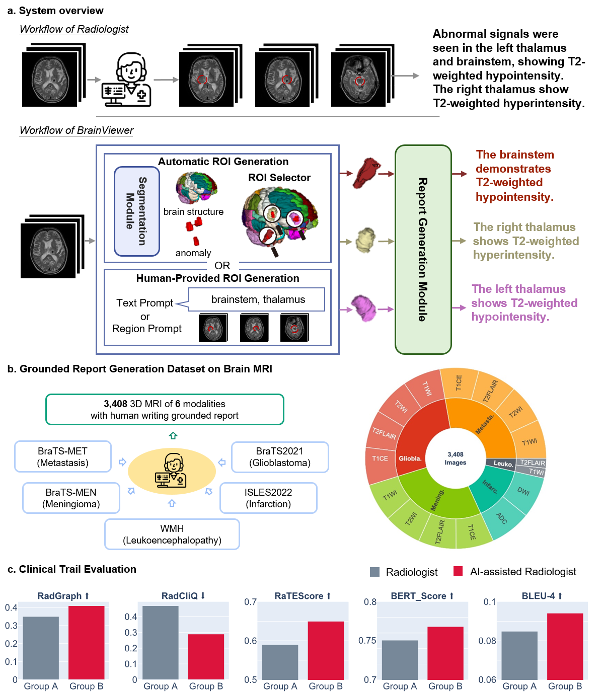

<!-- <h1> RaTEScore</h1> -->
<h1> AutoRG-Brain</h1>

The official codes for "AutoRG-Brain: Grounded Report Generation for Brain MRI".

<div style='display:flex; gap: 0.25rem; '>
<!-- <a href='https://angelakeke.github.io/RaTEScore/'></a> -->
<a href='https://huggingface.co/JiayuLei/AutoRG_Brain'></a>
<a href='https://huggingface.co/datasets/JiayuLei/RadGenome-Brain_MRI'></a>
<!-- <a href='https://arxiv.org/pdf/2406.16845'></a> -->
</div>

## Introduction
In this paper, we aim to develop an open-source, comprehensive image interpretation model for brain MRI. In general, we present the contribution from the following aspects: 
1. **Grounded Report Generation dataset.** We curate a dataset for grounded report generation, termed as RadGenome-Brain MRI, which
encompasses 3,408 multi-modal scans, reports, and ground truth anomaly segmentation masks, covering 5 disease types and 6 MRI modalities, that enables the grounded report generation training and validation on brain MRI.
2. **System Design.** we build up the first regional brain MRI report generation system, termed AutoRG-Brain (Automatic grounded Report Generation for Brain MRI), enabling automatic anomaly ROI generation or human interaction by inputting visual masks and generating well-organized reports to describe observations for each suspicious abnormal region.
3. **System Evaluation.** Our proposed system excels in brain anomaly and structure segmentation and achieves state-of-the-art report generation ability at both global and regional levels in both auto-metrics and human evaluation. In real clinical settings, AutoRG-Brain has demonstrated its potential to assist radiologists by integrating seamlessly into their daily workflows. This integration enables AI-powered junior radiologists to produce reports comparable in quality to senior radiologists, thereby significantly enhancing overall healthcare quality. 




## Model Inference

Download our **Segmentation module**, we default to use our [AutoRG_Brain_SEG](https://huggingface.co/JiayuLei/AutoRG_Brain/tree/main) which is pre-trained on :
- Our in-house clinical dataset ;
- Public brain anomaly segmentation datasets datasets: [ATLAS](https://fcon_1000.projects.nitrc.org/indi/retro/atlas.html), [BraTS2021](https://www.med.upenn.edu/cbica/brats2021/), [BraTS-MEN](https://www.synapse.org/Synapse:syn51156910/wiki/622353), [BraTS-MET](https://www.synapse.org/Synapse:syn51156910/wiki/622553), [BraTS-PED](https://www.synapse.org/Synapse:syn51156910/wiki/622461), [BraTS-SSA](https://www.synapse.org/Synapse:syn51156910/wiki/622556), [ISLES2022](https://www.isles-challenge.org/), [WMH](https://wmh.isi.uu.nl/) ;
- Public brain structure segmentation dataset: [Hammers-n30r95](http://brain-development.org/brain-atlases/).

Download our **Report Generation module**, we have two versions:
- [AutoRG_Brain_RGv1](https://huggingface.co/JiayuLei/AutoRG_Brain/tree/main/RG_v1). This model is pre-trained on our in-house clinical dataset and our released [RadGenome_Brain_MRI](https://huggingface.co/datasets/JiayuLei/RadGenome-Brain_MRI) dataset. 
- [AutoRG_Brain_RGv2](https://huggingface.co/JiayuLei/AutoRG_Brain/tree/main/RG_v2). This model is pre-trained on our released [RadGenome_Brain_MRI](https://huggingface.co/datasets/JiayuLei/RadGenome-Brain_MRI) dataset.

First prepare a test_file.json which lists information of all the testing images (nifti format please). Note that, 
- You should specify the image modality for each input image (T1WI, T2WI, T2FLAIR, DWI).
- If you already have a ground truth anomaly segmentation mask or anatomy segmentation mask for some input images, which you want to use during the report inference and don't need our segmentation module to infer the segmentation mask, please specify your anomaly segmentation mask path under "label" filed and your anatomy segmentation mask path under "label2" field. Otherwise, if you don't have any masks for a input image, then just leave out the "label" and "label2" fields.

A possible example is shown below. In this example, some input images already have both masks, some images have only one type of mask, and others don't have any masks.

```json
[
      {
        "image": "/path/to/the/image1.nii.gz",
        "modal": "DWI",
        "label": "/path/to/the/anomaly_segmentation.nii.gz",
        "label2": "/path/to/the/anatomy_segmentation.nii.gz"
      },
      {
        "image": "/path/to/the/image2.nii.gz",
        "modal": "T2WI",
        "label": "/path/to/the/anomaly_segmentation.nii.gz"
      },
      {
        "image": "/path/to/the/image3.nii.gz",
        "modal": "T2WI",
        "label2": "/path/to/the/anatomy_segmentation.nii.gz"
      },
      {
        "image": "/path/to/the/image4.nii.gz",
        "modal": "T2FLAIR"
      }
]
```

To get the report and segmentation masks using the downloaded checkpoints, enter the AutoRG-Brain folder and run the following command in the terminal:

```shell
python test.py --eval_mode region_segtool --llm_folder /folder/store/the/llm_checkpoint --seg_folder /folder/store/the/segmentation_checkpoint --llm_chk AutoRG_Brain_RGv1 --seg_chk AutoRG_Brain_SEG -test /path/to/test_file.json -o /folder/to/store/the/output/report/and/masks
```

The output folder will contain both segmentation masks and predict report. 

- **Segmentation Output:** If an input image already specify "label" or "label2" fields, then the output folder won't contain the corresponding mask type for that image, otherwise, the output folder will output segmentation masks of the input image. The default naming of the segmentation masks is written in AutoRG_Brain\inference\inferenceSdk.py line 223-237: for anomaly segmentation masks, use '_ab.nii.gz' to replace the '.nii.gz' in the original image name; for anatomy segmentation masks, use '_ana.nii.gz' to replace the '.nii.gz' in the original image name.

- **Report Output:** the output_folder/pred_report.json contains the predict report. For the input test_file.json shown above, the pred_report.json is as follows:

```json

[
    {
        "image": [
            "/path/to/the/image1.nii.gz"
        ],
        "pred_report": "The brain pools..",
        "ab_mask": "/path/to/the/anomaly_segmentation.nii.gz",
        "ana_mask": "/path/to/the/anatomy_segmentation.nii.gz"
    },
    {
        "image": [
            "/path/to/the/image2.nii.gz"
        ],
        "pred_report": "The lesion exhibits..",
        "ab_mask": "/path/to/the/anomaly_segmentation.nii.gz",
        "ana_mask": "output_folder/image2_ana.nii.gz"
    },
    {
        "image": [
            "/path/to/the/image3.nii.gz"
        ],
        "pred_report": "There is..",
        "ab_mask": "output_folder/image3_ab.nii.gz",
        "ana_mask": "/path/to/the/anatomy_segmentation.nii.gz"
    },
    {
        "image": [
            "/path/to/the/image4.nii.gz"
        ],
        "pred_report": "The ventricles..",
        "pred_ab_mask": "output_folder/image4_ab.nii.gz",
        "pred_ana_mask": "output_folder/image4_ana.nii.gz"
    }
]
```

You can use our released dataset [RadGenome_Brain_MRI](https://huggingface.co/datasets/JiayuLei/RadGenome-Brain_MRI) as the comparison baseline. The train/val/test split is [here](https://huggingface.co/datasets/JiayuLei/RadGenome-Brain_MRI/blob/main/train_val_test_split.json). For each dataset sub folder, we use the report in 'modal_wise_finding.json' as our ground truth report for each image. 

To run inference on RadGenome_Brain_MRI using our model. Prepare a test file in the following json format, please ensure the ground truth segmentation mask is specified under "label" field for each image:
```json
[
      {
        "image": "/path/to/the/image1.nii.gz",
        "modal": "T2FLAIR",
        "label": "/path/to/the/ground_truth/anomaly_segmentation.nii.gz"
      }
]
```
Then enter the AutoRG-Brain folder and run the following command in the terminal:

```shell
python test.py --eval_mode given_mask --llm_folder /folder/store/the/llm_checkpoint --seg_folder /folder/store/the/segmentation_checkpoint --llm_chk AutoRG_Brain_RGv2 --seg_chk AutoRG_Brain_SEG -test /path/to/test_file.json -o /folder/to/store/the/output/report/and/masks
```

A step-by-step demo is shown in AutoRG-Brain-master/AutoRG_Brain/demo.ipynb

<!-- ### Segmentation Module
For **Segmentation module**, we default to use our [AutoRG_Brain_SEG model](https://huggingface.co/JiayuLei/AutoRG_Brain/tree/main) which is pre-trained on :
- Our in-house clinical dataset ;
- Public brain anomaly segmentation datasets datasets: [ATLAS](https://fcon_1000.projects.nitrc.org/indi/retro/atlas.html), [BraTS2021](https://www.med.upenn.edu/cbica/brats2021/), [BraTS-MEN](https://www.synapse.org/Synapse:syn51156910/wiki/622353), [BraTS-MET](https://www.synapse.org/Synapse:syn51156910/wiki/622553), [BraTS-PED](https://www.synapse.org/Synapse:syn51156910/wiki/622461), [BraTS-SSA](https://www.synapse.org/Synapse:syn51156910/wiki/622556), [ISLES2022](https://www.isles-challenge.org/), [WMH](https://wmh.isi.uu.nl/) ;
- Public brain structure segmentation dataset: [Hammers-n30r95](http://brain-development.org/brain-atlases/).


To test the segmentation performance, first, prepare a test file in the following json format to describe the test data.
```json
[
    {
        "dis": "disease type of your test data or unknown",
        "image": "/path/to/image.nii.gz",
        "label": "/path/to/seg.nii.gz",
        "modal": "T2FLAIR or T1WI or T2WI or DWI"
    }
]
```
To test segmentation metric on anomaly segmentation dataset and output the anomaly and brain strucuture segmentation result, enter the AutoRG-Brain folder and run the following command in the terminal:

```shell
python test_seg.py --modal T2FLAIR --save_output_nii --dice_type abnormal -model_folder /path/to/checkpoint/folder -chk AutoRG_Brain_SEG -test /path/to/the/above/test_file.json -o /output/folder/to/save/anomaly/and/structure/segmentation
```
If you only need to calculate metric and do not want to save the segmentation result, simply delete the '--save_output_nii' parameter:
```shell
python test_seg.py --modal T2FLAIR --dice_type abnormal -model_folder /path/to/checkpoint/folder -chk AutoRG_Brain_SEG -test /path/to/the/above/test_file.json -o /output/folder/to/save/anomaly/and/structure/segmentation
```
### Report Generation Module
For **Report Generation module**, we have two versions:
- [AutoRG_Brain_RGv1](https://huggingface.co/JiayuLei/AutoRG_Brain/tree/main/RG_v1). This model is pre-trained on our in-house clinical dataset and our released [RadGenome_Brain_MRI](https://huggingface.co/datasets/JiayuLei/RadGenome-Brain_MRI) dataset. 
- [AutoRG_Brain_RGv2](https://huggingface.co/JiayuLei/AutoRG_Brain/tree/main/RG_v2). This model is pre-trained on our released [RadGenome_Brain_MRI](https://huggingface.co/datasets/JiayuLei/RadGenome-Brain_MRI) dataset.

The list of the test images of our released dataset is [here](https://huggingface.co/datasets/JiayuLei/RadGenome-Brain_MRI/blob/main/train_val_test_split.json). For each dataset sub folder, we use the report in 'modal_wise_finding.json' as our ground truth report for each image. 
To run inference on [RadGenome_Brain_MRI](https://huggingface.co/datasets/JiayuLei/RadGenome-Brain_MRI), first, prepare a test file in the following json format according to the [test list](https://huggingface.co/datasets/JiayuLei/RadGenome-Brain_MRI/blob/main/train_val_test_split.json) and ground truth report. The anomaly segmentation and anatomy segmentation mask can either from your ground truth file or our segmentation module.
```json
[
    {
        "image": "/path/to/image.nii.gz",
        "label": "/path/to/anomaly_segmentation.nii.gz",
        "label2": "/path/to/anatomy_segmentation.nii.gz",
        "modal": "T2FLAIR",
        "report": {
            "On the FLAIR sequence, the aforementioned lesion within the left frontal lobe exhibits high signal intensity. Surrounding brain edema is noted.": "mask"
        }
    }
]
```

To test report generation metric using AutoRG_Brain_RGv1 or AutoRG_Brain_RGv2, enter the AutoRG-Brain folder and run the following command in the terminal:

```shell
# AutoRG_Brain_RGv1
python test_llm.py --eval_mode given_mask --model_folder /path/to/checkpoint/folder -chk AutoRG_Brain_RGv1 -seg_pretrained /path/to/saved/segmentation/checkpoint/AutoRG_Brain_SEG.model -test /path/to/the/above/test_file.json -o /output/folder/to/save/generated/report

# AutoRG_Brain_RGv2
python test_llm.py --eval_mode given_mask --model_folder /path/to/checkpoint/folder -chk AutoRG_Brain_RGv2 -seg_pretrained /path/to/saved/segmentation/checkpoint/AutoRG_Brain_SEG.model -test /path/to/the/above/test_file.json -o /output/folder/to/save/generated/report
``` -->

## Model Training
### Default Paths

Use AutoRG_Brain/paths.py to config default setting during training.

```shell
#### local path ####
base = '/path/to/store/raw_data'
preprocessing_output_dir = '/path/to/store/preprocessed_files'
network_training_output_dir_base = '/path/to/store/output/checkpoints_logs_tensorboards_etc'

#### bucket path If you use storage like aws s3 ####
preprocessing_output_dir_bucket = 's3://path//to//store//preprocessed_files'
nnUNet_cropped_data_bucket = 's3://path//to//store//cropped_files'
```
<!-- You can store your preprocessed data under 'preprocess_data/', the training json files under 'raw_data/', and the model checkpoints, logs, tensorboard outputs under 'saved_model/'. You can also save it in other local folders of yours. -->

### Prepare Training Files  
Prepare the following json files in the 'Task' sub-folders under 'raw_data/'
```
|-- raw_data
    |-- Task001_seg_test
        |-- case_dic.json
        |-- dataset.json
        |-- test_file.json
    |-- Task002_llm_test
        |-- case_dic.json
        |-- dataset.json
        |-- test_file.json
```
- case_dic.json : Record the image identifiers belonging to different MRI sequences. 

The case_dic path should be set at the dataset loading document, for segmentation module, it should be set at 'AutoRG_Brain\dataset\dataset_loading_bucket.py' line 235; for report generation module, it should be set at 'AutoRG_Brain\dataset\dataset_loading_llm_bucket_resize_new.py' line 238

Note:You can generate the case identifiers based on get_case_identifier() function in 'AutoRG_Brain/experiment_planning_bucket/cropping_llm_bucket.py'

```code
{
    "DWI":[
        case_identifier,
        ...
    ],
    "T1WI":[],
    "T2WI":[],
    "T2FLAIR":[]
} 
```
 - dataset.json : Store the information of the trainig dataset, especially the image paths and MRI sequence
 ```code
 {
    "description": "the training dataset",
    "labels": {
        "0":"background",
        "1":"1",
        ...
        },
    "modality": {
        "0": "MRI"
    },
    "name": "dataset_name",
    "numTest": 0,
    "numTraining": 1,
    "reference": "no",
    "release": "0.0",
    "tensorImageSize": "4D",
    "test": [],
    "training": [
        {
            "image": "path/to/the/image.nii.gz",
            "label1": "path/to/the/anatomy_mask.nii.gz",
            "label2": "path/to/the/anomaly_mask.nii.gz",
            "modal": "T1WI"
        }
    ]
 }
 ```
 - test_file.json : Store the training and validation split
```shell
## segmentation test file ##
```
```code
{
    "training":[case_identifier, .. ],
    "validation": {
        "test":[case_identifier, ..]
    }
}
```
```shell
## report geenration llm test file ##
```
```code
{
    "region_report":{
        "training":{
            // for the anomaly mask guidance sample e.g. RadGenome Brain MRI dataset
            case_identifier: { "report content": "mask" }, 
            // for the sub-brain structure mask guidance sample
            case_identifier: {
                // Here, 40 is the sub-structure's label index
                "the grounded report content": [40],
                // Here, [45,46,47,48,49] is the label indexes from multiple sub-structures
                "the grounded report content": [45,46,47,48,49],
                // Here, "global" means the global report
                "the global report content ": "global"
            },
            ...
        },
        "validation":{
            // same format as training
        }
    },
    "training":[case_identifier, ..],
    "validation":[case_identifier, ..]
}
```
### Run Training

- Run segmentation module training

cd AutoRG_Brain

```shell
## preprocess the dataset
python -m experiment_planning_bucket.nnUNet_plan_and_preprocess_llm_bucket -t 1 --verify_dataset_integrity

## run training
python train_seg.py 3d_fullres nnUNetTrainerV2 001 0 --network_type share --bucket --abnormal_type intense -train_batch 1000 -val_batch 5 -train raw_data/Task001_seg_test/test_file.json
```

- Run report generation module training

```shell

## preprocess the dataset
## the plan_file should be the preprocess pkl file used in segmentation training, which is stored at 
python -m experiment_planning_bucket.nnUNet_plan_and_preprocess_llm_bucket -t 2 --verify_dataset_integrity --plan_file Task001_seg_test/nnUNetPlansv2.1_plans_3D.pkl

## run training 
## the plan_file is the same as above
python train_llm.py 3d_fullres nnUNetTrainerV2 002 0 --dataset six --size 4 --bucket --no_aug --feature_layer 2 -train_batch 1000 -val_batch 10 --network_type share -seg_pretrained /path/to/your/segmentation_model_checkpoint.model -train raw_data/Task002_llm_test/test_file.json --plans_file Task001_seg_test/nnUNetPlansv2.1_plans_3D.pkl

```

## RadGenome-Brain MRI Dataset

[RadGenome-Brain MRI Dataset]() is a curated grounded report generation dataset. It comprises 1,007 cases of 3,408 imaging-report pairs. The image data are sourced from five well-known public anomaly segmentation datasets, including the ISLES2022, White Matter Hyperintensity Challenge Dataset (WMH), BraTS2021, BraTS-MEN, and BraTS-MET, covering 6 MRI modalities (T1-weighted, T2-weighted, DWI, T2-Flair, ADC, and T1-contrast) and 5 distinct disease types (infarction, white matter hyperintensity, glioma, meningioma, and metastasis). We invite five radiologists (4-5 years) to write report findings and impressions for the annotated anomaly area of each patient case. The training, validation, and testing split are shown in below.

<table>
<tr>
<td rowspan="2">Dataset</td> <td rowspan="2">Sub-dataset</td> <td rowspan="2">Modality</td> <td align="center" colspan="3">Annotation</td> <td align="center" colspan="3">Image Split</td>
</tr>

<tr>
<td>Reports</td> <td>Anomaly Segmentation</td> <td>Anatomical Segmentation</td> <td>Training</td> <td>Validation</td> <td>Test</td>
</tr>
<tr>
<td rowspan="5">RadGenome-Brain MRI </td><td>BraTS2021</td><td rowspan="3">T1WI, T1C, T2WI, T2FLAIR</td> <td>&#10003;</td> <td>&#10003;</td> <td>&#10003*</td> <td>644</td> <td>92</td> <td>184</td>
</tr>
<td>BraTS-MEN</td><td>&#10003;</td> <td>&#10003;</td> <td>&#10003*</td> <td>644</td> <td>92</td> <td>184</td>
<tr>
<td>BraTS-MET</td><td>&#10003;</td> <td>&#10003;</td> <td>&#10003*</td> <td>660</td> <td>92</td> <td>196</td>
</tr>
<tr>
<td>ISLES2022</td><td>DWI, ADC</td><td>&#10003;</td> <td>&#10003;</td> <td>&#10003*</td> <td>350</td> <td>50</td> <td>100</td>
</tr>
<tr>
<td>WMH</td><td>T1WI, T2FLAIR</td><td>&#10003;</td> <td>&#10003;</td> <td>&#10003*</td> <td>84</td> <td>12</td> <td>24</td>
</tr>
</table>


## Contact
If you have any questions, please feel free to contact misslei@mail.ustc.edu.cn.

<!-- ## Citation
```bibtex
@article{zhao2024ratescore,
  title={RaTEScore: A Metric for Radiology Report Generation},
  author={Zhao, Weike and Wu, Chaoyi and Zhang, Xiaoman and Zhang, Ya and Wang, Yanfeng and Xie, Weidi},
  journal={arXiv preprint arXiv:2406.16845},
  year={2024}
}
``` -->
