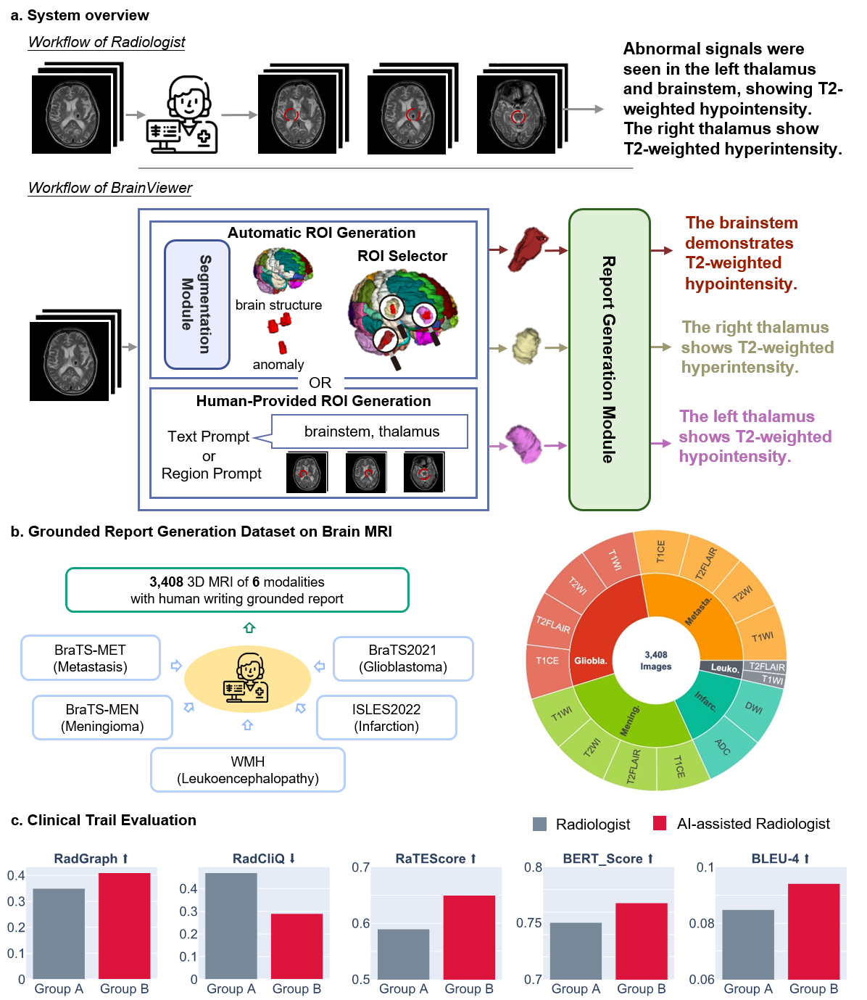

<!-- <h1> RaTEScore</h1> -->
<h1> AutoRG-Brain</h1>

The official codes for "AutoRG-Brain: Grounded Report Generation for Brain MRI".

<div style='display:flex; gap: 0.25rem; '>
<!-- <a href='https://angelakeke.github.io/RaTEScore/'></a> -->
<a href='https://huggingface.co/JiayuLei/AutoRG_Brain'></a>
<a href='https://huggingface.co/datasets/JiayuLei/RadGenome-Brain_MRI'></a>
<!-- <a href='https://arxiv.org/pdf/2406.16845'></a> -->
</div>

## Introduction
In this paper, we aim to develop an open-source, comprehensive image interpretation model for brain MRI. In general, we present the contribution from the following aspects: 
1. **Grounded Report Generation dataset.** We curate a dataset for grounded report generation, termed as RadGenome-Brain MRI, which
encompasses 3,408 multi-modal scans, reports, and ground truth anomaly segmentation masks, covering 5 disease types and 6 MRI modalities, that enables the grounded report generation training and validation on brain MRI.
2. **System Design.** we build up the first regional brain MRI report generation system, termed AutoRG-Brain (Automatic grounded Report Generation for Brain MRI), enabling automatic anomaly ROI generation or human interaction by inputting visual masks and generating well-organized reports to describe observations for each suspicious abnormal region.
3. **System Evaluation.** Our proposed system excels in brain anomaly and structure segmentation and achieves state-of-the-art report generation ability at both global and regional levels in both auto-metrics and human evaluation. In real clinical settings, AutoRG-Brain has demonstrated its potential to assist radiologists by integrating seamlessly into their daily workflows. This integration enables AI-powered junior radiologists to produce reports comparable in quality to senior radiologists, thereby significantly enhancing overall healthcare quality. 



<!-- For more detailed about our pipeline, please refer to our [paper](https://arxiv.org/pdf/2406.16845). -->

<!-- ## Installation

### Environment Preparation
```
pip install RaTEScore
``` -->

## Model Inference

### Segmentation Module
For **Segmentation module**, we default to use our [AutoRG_Brain_SEG model](https://huggingface.co/JiayuLei/AutoRG_Brain/tree/main) which is pre-trained on :
- Our in-house clinical dataset ;
- Public brain anomaly segmentation datasets datasets: [ATLAS](https://fcon_1000.projects.nitrc.org/indi/retro/atlas.html), [BraTS2021](https://www.med.upenn.edu/cbica/brats2021/), [BraTS-MEN](https://www.synapse.org/Synapse:syn51156910/wiki/622353), [BraTS-MET](https://www.synapse.org/Synapse:syn51156910/wiki/622553), [BraTS-PED](https://www.synapse.org/Synapse:syn51156910/wiki/622461), [BraTS-SSA](https://www.synapse.org/Synapse:syn51156910/wiki/622556), [ISLES2022](https://www.isles-challenge.org/), [WMH](https://wmh.isi.uu.nl/) ;
- Public brain structure segmentation dataset: [Hammers-n30r95](http://brain-development.org/brain-atlases/).


To test the segmentation performance, first, prepare a test file in the following json format to describe the test data.
```json
[
    {
        "dis": "disease type of your test data or unknown",
        "image": "/path/to/image.nii.gz",
        "label": "/path/to/seg.nii.gz",
        "modal": "T2FLAIR  or T1WI or T2WI or DWI"
    }
]
```
To test segmentation metric on anomaly segmentation dataset and output the anomaly and brain strucuture segmentation result, enter the AutoRG-Brain folder and run the following command in the terminal. Here, we use 'srun' command as the example:

```shell
srun -p partition_name -N 1 --quotatype auto --gres=gpu:1 python test_seg.py --modal T2FLAIR --save_output_nii --dice_type abnormal -model_folder /path/to/checkpoint/folder -chk AutoRG_Brain_SEG -test /path/to/the/above/test_file.json -o /output/folder/to/save/anomaly/and/structure/segmentation
```
If you only need to calculate metric and do not want to save the segmentation result, simply delete the '--save_output_nii' parameter:
```shell
srun -p partition_name -N 1 --quotatype auto --gres=gpu:1 python test_seg.py --modal T2FLAIR --dice_type abnormal -model_folder /path/to/checkpoint/folder -chk AutoRG_Brain_SEG -test /path/to/the/above/test_file.json -o /output/folder/to/save/anomaly/and/structure/segmentation
```
### Report Generation Module
For **Report Generation module**, we have two versions:
- [AutoRG_Brain_RGv1](https://huggingface.co/JiayuLei/AutoRG_Brain/tree/main/RG_v1). This model is pre-trained on our in-house clinical dataset and our released [RadGenome_Brain_MRI](https://huggingface.co/datasets/JiayuLei/RadGenome-Brain_MRI) dataset. 
- [AutoRG_Brain_RGv2](https://huggingface.co/JiayuLei/AutoRG_Brain/tree/main/RG_v2). This model is pre-trained on our released [RadGenome_Brain_MRI](https://huggingface.co/datasets/JiayuLei/RadGenome-Brain_MRI) dataset.

The list of the test images of our released dataset is [here](https://huggingface.co/datasets/JiayuLei/RadGenome-Brain_MRI/blob/main/train_val_test_split.json). For each dataset sub folder, we use the report in 'modal_wise_finding.json' as our ground truth report for each image. 
To run inference on [RadGenome_Brain_MRI](https://huggingface.co/datasets/JiayuLei/RadGenome-Brain_MRI), first, prepare a test file in the following json format according to the [test list](https://huggingface.co/datasets/JiayuLei/RadGenome-Brain_MRI/blob/main/train_val_test_split.json) and ground truth report.
```json
[
    {
        "image": "/path/to/image.nii.gz",
        "label": "/path/to/seg.nii.gz",
        "modal": "T2FLAIR",
        "report": {
            "On the FLAIR sequence, the aforementioned lesion within the left frontal lobe exhibits high signal intensity. Surrounding brain edema is noted.": "mask"
        }
    }
]
```

To test report generation metric using AutoRG_Brain_RGv1 or AutoRG_Brain_RGv2, enter the AutoRG-Brain folder and run the following command in the terminal. Here, we use 'srun' command as the example:

```shell
# AutoRG_Brain_RGv1
srun -p partition_name -N 1 --quotatype auto --gres=gpu:1 python test_llm.py --eval_mode given_mask --model_folder /path/to/checkpoint/folder -chk AutoRG_Brain_RGv1 -seg_pretrained /path/to/saved/segmentation/checkpoint/AutoRG_Brain_SEG.model -test /path/to/the/above/test_file.json -o /output/folder/to/save/generated/report

# AutoRG_Brain_RGv2
srun -p partition_name -N 1 --quotatype auto --gres=gpu:1 python test_llm.py --eval_mode given_mask --model_folder /path/to/checkpoint/folder -chk AutoRG_Brain_RGv2 -seg_pretrained /path/to/saved/segmentation/checkpoint/AutoRG_Brain_SEG.model -test /path/to/the/above/test_file.json -o /output/folder/to/save/generated/report
```

## RadGenome-Brain MRI Dataset

[RadGenome-Brain MRI Dataset]() is a curated grounded report generation dataset. It comprises 1,007 cases of 3,408 imaging-report pairs. The image data are sourced from five well-known public anomaly segmentation datasets, including the ISLES2022, White Matter Hyperintensity Challenge Dataset (WMH), BraTS2021, BraTS-MEN, and BraTS-MET, covering 6 MRI modalities (T1-weighted, T2-weighted, DWI, T2-Flair, ADC, and T1-contrast) and 5 distinct disease types (infarction, white matter hyperintensity, glioma, meningioma, and metastasis). We invite five radiologists (4-5 years) to write report findings and impressions for the annotated anomaly area of each patient case. The training, validation, and testing split are shown in below.

<table>
<tr>
<td rowspan="2">Dataset</td> <td rowspan="2">Sub-dataset</td> <td rowspan="2">Modality</td> <td align="center" colspan="3">Annotation</td> <td align="center" colspan="3">Image Split</td>
</tr>

<tr>
<td>Reports</td> <td>Anomaly Segmentation</td> <td>Anatomical Segmentation</td> <td>Training</td> <td>Validation</td> <td>Test</td>
</tr>
<tr>
<td rowspan="5">RadGenome-Brain MRI </td><td>BraTS2021</td><td rowspan="3">T1WI, T1C, T2WI, T2FLAIR</td> <td>&#10003;</td> <td>&#10003;</td> <td>&#10003*</td> <td>644</td> <td>92</td> <td>184</td>
</tr>
<td>BraTS-MEN</td><td>&#10003;</td> <td>&#10003;</td> <td>&#10003*</td> <td>644</td> <td>92</td> <td>184</td>
<tr>
<td>BraTS-MET</td><td>&#10003;</td> <td>&#10003;</td> <td>&#10003*</td> <td>660</td> <td>92</td> <td>196</td>
</tr>
<tr>
<td>ISLES2022</td><td>DWI, ADC</td><td>&#10003;</td> <td>&#10003;</td> <td>&#10003*</td> <td>350</td> <td>50</td> <td>100</td>
</tr>
<tr>
<td>WMH</td><td>T1WI, T2FLAIR</td><td>&#10003;</td> <td>&#10003;</td> <td>&#10003*</td> <td>84</td> <td>12</td> <td>24</td>
</tr>
</table>


## Contact
If you have any questions, please feel free to contact misslei@mail.ustc.edu.cn.

<!-- ## Citation
```bibtex
@article{zhao2024ratescore,
  title={RaTEScore: A Metric for Radiology Report Generation},
  author={Zhao, Weike and Wu, Chaoyi and Zhang, Xiaoman and Zhang, Ya and Wang, Yanfeng and Xie, Weidi},
  journal={arXiv preprint arXiv:2406.16845},
  year={2024}
}
``` -->